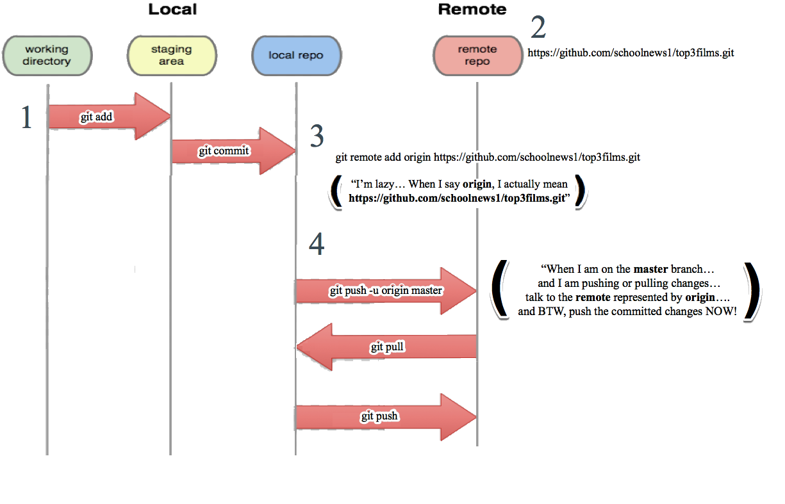

%title: Introduction to Git 
%author: Graeme Ludwig (graeme.ludwig@btopenworld.com)
%date: 2017-10-26

-> # IMPORTANT NOTE <-

-> ## Whilst this can be read as markdown... <-
^

-> ## it's best viewed using <-
^

[markdown presenter](https://github.com/visit1985/mdp)
^

-> *:) :) :)* <-
^

Controls:

* h, j, k, l, Arrow keys, Space, Enter, Backspace, Page Up, Page Down - next/previous slide
* Home, g - go to first slide
* End, G - go to last slide
* 1-9 - go to slide n
* r - reload input file
* q - exit
^

And don't forget to set:

    $ export TERM=xterm-256color

for the full colour experience!

-------------------------------------------------

-> # GIT - SESSION 1 <-

-> ## Version Control <-

-> ## Git on the Local Machine <-

-------------------------------------------------

-> # Imagine... <-

* You are working on a joint paper e.g. “10 ways ITV could improve its market share in TV advertising”.

* You need to collaborate with your colleague on the essay, and work on it from different offices.
  ^


-> # Questions <-
  
* How would you exchange information?

* What are the potential problems with any solution?

-------------------------------------------------

-> # Problems <-

* machine crashes
  ^

* different versions getting out of step…
  ^

* where is the latest up to date version?

  * someone’s email account? dropbox?...

  * what if 3 people are working on it, 4?
    ^


-> # The Answer... <-

* [Sharepoint](https://products.office.com/en-us/sharepoint/collaboration) :)
  ^

* Version control

-------------------------------------------------

-> # Version Control <-

* The cataloging of revisions to some (generally text-based) document.

* Google Docs and Dropbox automatically track document revisions and versions.

* For a paper, it is sufficient to be able to recover a previous (whole) version of a document.
  ^


* For large programming projects (and smaller ones too), it's more complicated...
  ^

* You're typically working with 10's, 100's of text files...
  ^

* You need software version control!

-------------------------------------------------

-> # 3 Goals of Version Control Systems <-

According to Eric Sink, the [3 Goals of Version Control Systems](http://ericsink.com/vcbe/html/intro.html) are:

* to allow developers to work simultaneously on the same project code

* to avoid conflicts arising from different developers working simultaneously on the same code
    
* to archive every version of everything that has ever existed — ever

-------------------------------------------------

-> # Software Version Control <-


* A software revision control system must be able to:
  ^

  * track all changes – deletions, additions, and moves – made by many users
  ^

  * efficiently show what was modified from version to version
  ^

  * support common features such as branching and merging.
  ^

  * development projects typically have changes that "branch" off into new side projects...
    ^

    * which sometimes "merge" back into the main development line
    ^

    * and at other times are discontinued

-------------------------------------------------

-> # Subversion (SVN) vs. Git <-


* SVN is centralised, Git is distributed
  * SVN, must be online to commit

  * Git, can commit offline
  ^

* SVN uses merge-before-commit.
  * Conflicts must be resolved before a change is accepted
  ^

* Git uses commit-before-merge.
  * Multiple branches can be committed, and conflicts resolved by merging them together. 
  ^

See [Understanding Version-Control Systems](http://www.catb.org/esr/writings/version-control/version-control.html) for more details.

-------------------------------------------------


-> # Top 3 Films - Initialise Repo <-

## init = "git, track all changes in this directory (top3films), and all subdirectories"

```
$ mkdir top3films
 
$ cd top3films
  
$ git init
```

> Initialized empty Git repository in top3films/.git/
^

* repository = a place or receptacle in which things are stored
^

    $ ls -l

> drwxr-xr-x  12 graeme.ludwig  staff   408 25 Oct 16:57 .git
^

* If you leave the directory (e.g. cd ..), git is no longer active.

-------------------------------------------------

-> # What's Goin On? <-

## "git status" is always safe to run. It tells you what is going on, and what just happened.

    $ git status
 
> On branch master
> Initial commit
> nothing to commit (create/copy files and use "git add" to track)
^

-> # What's a commit? <-

* A "commit" is a save point or a check point

* System makes the first commit, when git init is run

* Typically you’ll be making changes (adding new files, altering existing files)...

* ... then committing all of them together as a single group

-------------------------------------------------

-> # Adding a new file <-

Create a new file and view the status.

    $ touch top3films.txt
 
Edit the file and add your favourite film ONLY (i.e. only 1 film)...
^

    $ git status
 
> On branch master
> Initial commit
> Untracked files:
>   (use "git add <file>..." to include in what will be committed)
> 	top3films.txt
> nothing added to commit but untracked files present (use "git add" to track)

-------------------------------------------------

-> # The Staging Area <-


* 2 stage process

* Working directory is current directory you are in (e.g. top3films directory)

* The staging area allows you to pick and choose exactly which parts of your changes should be committed 

* Staging area invokes a sense of moving things spatially

* BUT files are not being moved from one directory to another

* Moving files from the "working directory" to the "staging area"...

* and then to the "repository" does not move them, but actually changes how Git is keeping track of them

-------------------------------------------------

-> # Adding a new file (continued...) <-

## git add = "Include the changes in this file."

```
$ git add top3films.txt
 
$ git status
```

> On branch master
> Initial commit
> Changes to be committed:
>   (use "git rm --cached <file>..." to unstage)
> 	new file:   top3films.txt
^

Time for a savepoint!

-------------------------------------------------

-> # But first... <-

-> ## Git configuration (git config) <-

The two key items to configure are:

* User name e.g.

```
git config --global user.name "alice"
```

* User email address e.g.

```
git config --global user.email "alice@training.com"
```

These are important as git uses them to mark your commits, so that others can see who made the change.

-------------------------------------------------

-> # git commit <-

## git commit = save the staged changes

    $ git commit -m "Initial version with first choice film"
   
> [master (root-commit) b7163d1] Initial version with first choice film
>  1 file changed, 3 insertions(+)
>  create mode 100644 top3films.txt
^

    $ git status
 
> On branch master
> nothing to commit, working directory clean
^

Time for some history...

-------------------------------------------------

-> # git log <-

## git log = Look at the history of changes i.e. of commits

This command suffers from command switch hell!
^

## The basic log command:

    $ git log
 
> commit b7163d1a18e80e3c3238efe86224d4117534c310        // unique identifier automatically generated
> Author: Graeme Ludwig <graeme.ludwig@btopenworld.com>  // you!
> Date:   Wed Jun 21 10:24:42 2017 +0100
> Initial version with first choice film                // comment previously entered when committing

-------------------------------------------------

-> # git log, continued <-

## The decorated command:
 
    $ git log  --decorate
 
> commit b7163d1a18e80e3c3238efe86224d4117534c310 (HEAD -> master, origin/master)
> Author: Graeme Ludwig <graeme.ludwig@btopenworld.com>
> Date:   Wed Jun 21 10:24:42 2017 +0100
> Initial version with first choice film
^

## The decorated oneline command:

    $ git log  --decorate --pretty=oneline
 
> b7163d1a18e80e3c3238efe86224d4117534c310 (HEAD -> master) Initial version with first choice film
^

## The decorated oneline abbreviated graphed command:

    $ git log  --graph --decorate --pretty=oneline --abbrev-commit
 
> b7163d1 (HEAD -> master) Initial version with first choice film

-------------------------------------------------

-> # Committing a File Edit <-

Edit the top3films.txt file, and add a second film choice

    $ git status

> On branch master
> Changes not staged for commit:
>   (use "git add <file>..." to update what will be committed)
>   (use "git checkout -- <file>..." to discard changes in working directory)
> 	modified:   top3films.txt
^

```
$ git add top3films.txt

$ git status
```

> On branch master
> Changes to be committed:
>   (use "git reset HEAD <file>..." to unstage)
> 	modified:   top3films.txt

-------------------------------------------------

-> # Committing a File Edit, continued <-

    $ git commit -m “Added second film choice”

> [master f9fe506] Added second film choice
>  1 file changed, 1 insertion(+)
^

    $ git status

> On branch master
> nothing to commit, working directory clean
^

    $ git log  --graph --decorate --pretty=oneline --abbrev-commit

> f9fe506 (HEAD -> master) Added second film choice
> b7163d1 Initial version with first choice film
^

Commit has HEAD, like a tape head, see:

* 

and 

* 

-------------------------------------------------

-> # git checkout, the git time-machine <-

    $ git log  --graph --decorate --pretty=oneline --abbrev-commit

> f9fe506 (HEAD -> master) Added second film choice
> b7163d1 Initial version with first choice film
^

    $ cat top3films.txt

> Top 3 Films
> (1) Rocky IV
> (2) Shawshank Redemption
^

Let's look at previous version:

    $ git checkout b7163d1

> ((HEAD detached at b7163d1))
^

    $ git log --graph --decorate --pretty=oneline --abbrev-commit

> b7163d1 (HEAD) Initial version with first choice film

-------------------------------------------------

-> # git checkout, continued <-

It's "rewound" the tape.

    $ cat top3films.txt

> Top 3 Films
> (1) Rocky IV
^

Go back to original:

    $ git checkout master

What is master?

-------------------------------------------------

-> # master branch <-

* 

* "master" is just the name of the default branch.

* It's called "master" because generally it's the branch that represents production code

* It's the branch that all other branches come from and generally eventually rejoin
^

* Git automatically calls the main branch "master". That is just a name for...
  ^

  * the good copy
  ^

  * the copy others might use so I should make it clean
  ^

-------------------------------------------------

-> # git diff <-

Look at changes...

    $ git log  --graph --decorate --pretty=oneline --abbrev-commit

> f9fe506 (HEAD -> master) Added second film choice
> b7163d1 Initial version with first choice film
^

    $ git diff b7163d1 // commit id of entry one back from the latest

Output is in a special format, which can be read by humans and computers alike:

> diff --git a/top3films.txt b/top3films.txt
> index 9ee5f81..919be68 100644
> --- a/top3films.txt
> +++ b/top3films.txt
> @@ -1,3 +1,4 @@
>  Top 3 Films
> 
>  (1) Rocky IV
> +(2) Shawshank Redemption

-------------------------------------------------

-> # GIT - SESSION 2 <-

-> ## Collaboration <-

-------------------------------------------------

-> # gitlab <-

* So far, only made changes to local machine. Time to share and collaborate!

* We use our own local gitlab server to collaborate

* This is a git repo (like your top3films repo), BUT on a remote machine "in the cloud"

* The repo is where everyone (permitted) can put things in and take things out

* You'll be working with an existing repo shortly e.g. [alice and bob's repo](git@gitlab.server.com:training/git-practice-alice-bob.git ~ this is an example URL only)

-------------------------------------------------

-> # master branch <-

* 

* "master" is just the name of the default branch.

* It's called "master" because generally it's the branch that represents production code

* It's the branch that all other branches come from and generally eventually rejoin
^

* Git automatically calls the main branch "master". That is just a name for...
  ^

  * the good copy
  ^

  * the copy others might use so I should make it clean
  ^

  * the version of my code that my boss cares about

-------------------------------------------------

-> # Creating a git repository online <-

The git history of the repo you'll be working on shortly is:

    $ git log --graph --decorate --pretty=oneline --abbrev-commit

> 3fa219c (HEAD -> master, origin/master, origin/HEAD) Updated log command with --graph option
> 04127bc (HEAD -> master, origin/master, origin/HEAD) Added useful stuff to readme
> 7f03f5e Added sports news of the day
> 19b90f4 Added the head's choice of sequel to remake
> 876d2fa Start of issue 251
> ad7e22d Initial commit>
^

But how was this repository created on gitlab? The typical steps are...

-------------------------------------------------

-> # Creating a gitlab repository online, continued <-

-> Step 1 <-

Create a new repository online via the [gitlab website](https://gitlab.com/explore).
^

Or via the website of your chosen Git version control repository hosting service e.g....
^

* [GitHub](https://github.com/)
^

* [Bitbucket](https://bitbucket.org/)
^

* etc...

-------------------------------------------------

-> # Creating a gitlab repository online, continued <-

-> Step 2 <-

_Haven't written any code yet?_

Then...
^

* create a new git repository on your local machine
^

* write the code you wish to share online
^

* commit it to your local git repo
^

These steps were previously covered in session 1 of this tutorial.
^


_Written the code but it's not in git?_

Then...
^

* initialise the directory containing the code as a git repo
^

* commit the code to the local git repo
^

Again, these steps were previously covered in session 1 of this tutorial.
^


_Already got the code on your machine in a local git repo?_
^

Good for you; you're already ready for the next step!

-------------------------------------------------

-> # Creating a gitlab repository online, continued <-

-> Step 3 <-

* Configure your local git repo to point to your new online repository.
^

* 'Push' the code from your local repo to the online repo.

-------------------------------------------------

-> # Sharing the top3 films repo online <-

Start with the top3 films repo created on a local machine in session 1.

    $ cd ~/code/workExperience/top3films
    $ git log --graph --decorate --pretty=oneline --abbrev-commit

> 3fa219c (HEAD -> master, origin/master, origin/HEAD) Updated log command with --graph option
> 04127bc (HEAD -> master, origin/master, origin/HEAD) Added useful stuff to readme
> 7f03f5e Added sports news of the day
> 19b90f4 Added the head's choice of sequel to remake
> 876d2fa Start of issue 251
> ad7e22d Initial commit>
^

Assume that we've already created a corresponding 'top 3 films' repo online, via the gitlab web page interface.

The [online repo's URL](git@gitlab.server.com:training/top-3-films.git) is automatically provided by gitlab on creating the new online repo.

So we're now at 'step 3' i.e. we have a local git repo (top3films) that we want to point to the newly created online repository.

-------------------------------------------------

-> # Sharing the top3 films repo online, continued <-

We do this by adding a remote. A 'remote' is a pointer to a repo that is outside of the current repo, typically on another machine.


^

Initially when initialising a local repo, there are no remotes:

    $ git remote -v

> $
^

Add the remote:

    $ git remote add origin git@gitlab.server.com:training/top-3-films.git
^

And check it now exists:

    $ git remote -v

> origin	git@gitlab.server.com:training/top-3-films.git (fetch)
> origin	git@gitlab.server.com:training/top-3-films.git (push)

Note:

* "origin" = the remote repository from which the local repository originates (e.g. on gitlab)

-------------------------------------------------

-> # Sharing the top3 films repo online, continued <-

Now push the files from the local repo to the remote (online) repo:

    $ git push -u origin master

Demonstrate that the files have appeared in github.
^

This is a one-off operation. In future, just use:

    $ git push
^

Now other people can pull this repo and make changes to it.
^

NOTE:
* When working with github, the first part (making changes on machine, staging changes, committing to local repo) is the same as per session 1.

* Difference comes with sending files to, getting files from, the remote repo.

-------------------------------------------------

-> # Git Collaboration Exercise <-

* There are six laptops and six users:

  * alice
  * bob
  * carol
  * david
  * eve
  * frank

* The users will collaborate in pairs using one of 3 gitlab repos as follows:

  * git@gitlab.server.com:training/git-practice-alice-bob.git (alice & bob)
  
  * git@gitlab.server.com:training/git-practice-carol-david.git (carol & david)

  * git@gitlab.server.com:training/git-practice-eve-frank.git (eve & frank)

-------------------------------------------------

-> # Cloning a Repo <-

When working with a remote repo, many activities are unchanged e.g.

  * making changes in local repo

  * staging changes on local repo
 
  * committing to local repo
^

Difference comes with sending files to, getting files from, the remote repo.

  * What if I didn’t create the remote repo? How do I get it on my machine? git clone!
  ^

  * Using alice as an example...

-------------------------------------------------

-> # Alice Cloning a Repo <-

```
$ git clone git@gitlab.server.com:training/git-practice-alice-bob.git
```

* This creates directory git-practice-alice-bob.
^

```
$ cd git-practice-alice-bob
 
$ ls -l (list of files, plus special .git)
```

> drwxr-xr-x  15 alice  staff   510 25 Oct 16:08 .git
> -rw-r--r--   1 alice  staff  4032 25 Oct 15:46 README.md
> -rw-r--r--   1 alice  staff  1237 25 Oct 10:01 issue251.txt

-------------------------------------------------

-> # Kick the repo's tyres <-

    $ git log --graph --decorate --pretty=oneline --abbrev-commit

> 3fa219c (HEAD -> master, origin/master, origin/HEAD) Updated log command with --graph option
> 04127bc (HEAD -> master, origin/master, origin/HEAD) Added useful stuff to readme
> 7f03f5e Added sports news of the day
> 19b90f4 Added the head's choice of sequel to remake
> 876d2fa Start of issue 251
> ad7e22d Initial commit>
^

    $ git diff 876d2fa 19b90f4

> diff --git a/issue251.txt b/issue251.txt
> ...
> (2) The Big Question: What film or TV series would you like to be remade?
>
> -A person : A choice
> +The Headmaster : The Fresh Prince of Bel Air
>
> (TOM, GEORGE, HANNAH to interview students and teachers)

-------------------------------------------------

-> # Updating the same file with no merge conflict <-

Initial state; 
^

* _Alice_: Update *issue251.txt* file, add new films to be given sequels, commit, git push; 

* View the change via git log.

* View change on gitlab e.g. [alice-bob](gitlab.server.com:training/git-practice-alice-bob.git)
^

* _Bob_: Update *issue251.txt* file, add sports results of the day.
^

* Next, _Bob_ tries to push. What will happen? 
^

    $ git push

> ! [rejected]        master -> master (non-fast-forward)
> hint: 'git pull ...') before pushing again.

* It fails, as git knows that file has been updated by someone else i.e _Alice_

-------------------------------------------------

-> # Updating the same file with no merge conflict, continued <-

* _Bob_ need to pull _Alice's_ changes:
   
```
$ git pull
```

* This pulls the change, and reapplies the new change (sports result) on top.

* If Alice and Bob haven’t touched the same parts of the file, we’re OK; 
^

* On pulling the change, an editor will be launched to write a comment for the merge commit.

* It will contain a default comment to say that a merge has taken place.

> Merge branch 'master' of gitlab.server.com:training/git-practice-alice-bob

* Alter it if needed, save and exit.

-------------------------------------------------

-> # Updating the same file with no merge conflict, continued <-

* Now _Bob_ pushes his change; 

* All changes have been made successfully. Check the history:

    $ git log --graph --decorate --pretty=oneline --abbrev-commit

> \*   137acfa (HEAD -> master) Merge branch 'master' of gitlab.server.com:training/git-practice-alice-bob
> |\\
> | \* 10a806e Added maths teacher's film choice
> \* | 4150196 Added sports news of the day
> |/
> \* 04127bc Added useful stuff to readme
> \* 7f03f5e Added sports news of the day
> \* 19b90f4 Added the head's choice of sequel to remake
> \* 876d2fa Start of issue 251
> \* ad7e22d Initial commit

-------------------------------------------------

-> # Merge conflicts <-

If two people update overlapping parts of the same file then a merge conflict will occur.

* _Alice_: Add your own sports result of the day.
^

* _Alice_: Push the change... it fails; 
^

    $ git pull

> Auto-merging issue251.txt
> CONFLICT (content): Merge conflict in issue251.txt
> Automatic merge failed; fix conflicts and then commit the result.

* Merge conflict; 

-------------------------------------------------

-> # Conflict Resoultion <-

    $ vi issue251.txt

> <<<<<<< HEAD
> Horse wins race.
> =======
> All premier league managers sacked on same day!
> \>>>>>>> 137acfa93d3a04a87ac077285641b4087aac5f98

* Edit the text by hand, commit changes and push; 
^

    $ git status

    $ git commit -am "Message...."   // -am is new option!

    $ git push

-------------------------------------------------

-> # What have I done? <-

    $ git log --graph --decorate --pretty=oneline --abbrev-commit

> \*   eb47080 (HEAD -> master, origin/master, origin/HEAD) Resolved conflict
> |\\
> | \*   137acfa Merge branch 'master' of gitlab.server.com:training/git-practice-alice-bob
> | |\\
> | \* | 4150196 Added sports news of the day
> \* | | 34dbf92 Added horse-related sports result of day
> | |/
> |/|
> \* | 10a806e Added maths teacher's film choice
> |/
> \* 04127bc Added useful stuff to readme
> \* 7f03f5e Added sports news of the day
> \* 19b90f4 Added the head's choice of sequel to remake
> \* 876d2fa Start of issue 251
> \* ad7e22d Initial commit
^

* Finally, _Bob_ can pull the latest version; 

-------------------------------------------------

## Useful Git Commands

| Command                                                  | Usage                                                                                            |
| -------------------------------------------------------- | :----------------------------------------------------------------------------------------------- |
| init                                                     | Initialise a local git repository                                                                |
| status                                                   | Status of local repository                                                                       |
|                                                          |   - what's going on?                                                                             |
|                                                          |   - what just happened?                                                                          |
| add <file>                                               | Include changes in file in next commit                                                           |
| rm <file>                                                | Remove file in next commit                                                                       |
| commit                                                   | Commit staged changes (editor launched to enter message)                                         |
| commit -m "Message"                                      | Commit staged changes with message                                                               |
| log                                                      | Look at history of changes (commits).                                                            |
| log  --pretty=oneline                                    | Display each commit on a single line, include branch and HEAD identifiers                        |
| log  --graph --decorate --pretty=oneline --abbrev-commit | Display history (user-friendly version)                                                          |
| diff                                                     | Show changes between commits                                                                     |
| clone <repository>                                       | Make a copy of a git repository                                                                  |
| branch                                                   | Mange (list, create) branche                                                                     |
| checkout                                                 | Switch branches                                                                                  |
| remote                                                   | Manage repositories. Remote is typically a git repository not on your computer (e.g. on github). |
| ls-remote                                                | List references in remote repository.                                                            |
| push                                                     | Push changes to a repository.                                                                    |
| pull                                                     | Get changes from a repository and merge them in.                                                 |
| fetch                                                    | Get the changes from a repository without merging.                                               |

-------------------------------------------------

-> # Not the end... <-

* Merging (practice practice practice!)

* Branching

* Re-writing history

* How to use git as a team

-------------------------------------------------

-> # Useful References <-

* [How to teach git](https://recompilermag.com/issues/issue-1/how-to-teach-git/)
* [Some of the things we've learned about teaching git](https://software-carpentry.org/blog/2012/12/some-of-the-things-weve-learned-about-teaching-git.html)
* [Git Explained](https://juristr.com/blog/2013/04/git-explained/)
* [Git Ready](http://gitready.com)
* Stack Overflow
* [Git in a Month of Lunches](https://www.manning.com/books/learn-git-in-a-month-of-lunches)

_*THE REAL END*_
